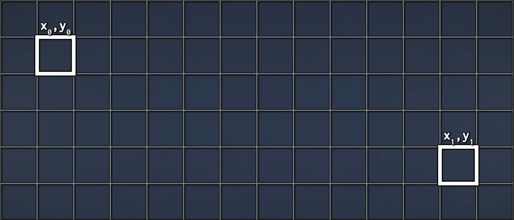
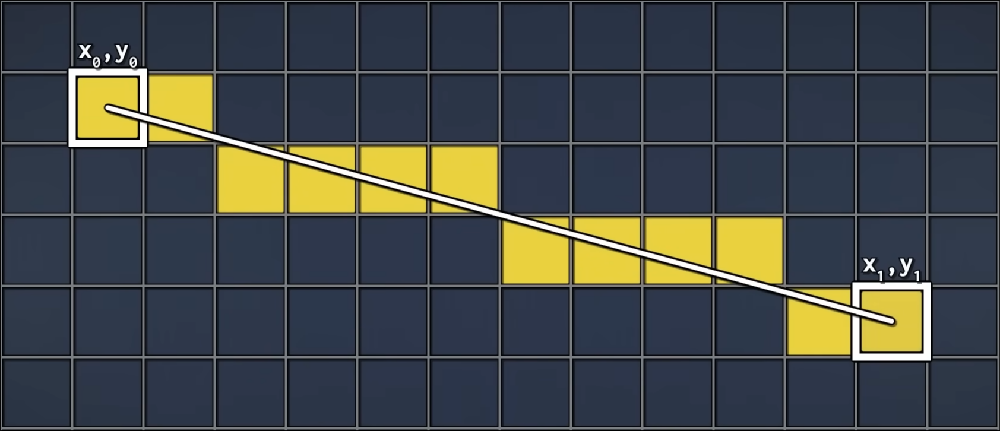
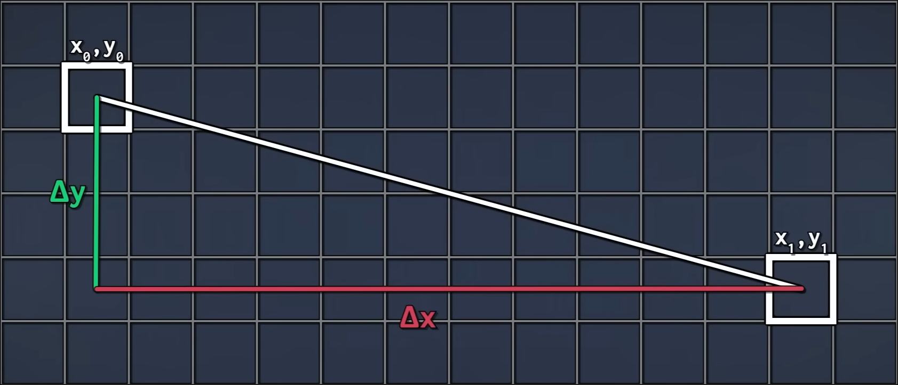
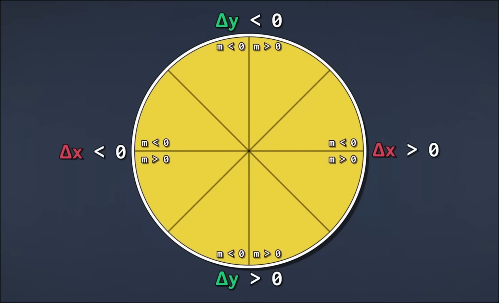

# Dia 2

No dia anterior, fomos introduzidos a conceitos básicos como pixels, cores e formatos de arquivos de imagem, como PPM. Hoje iremos começar nosso projeto com o repositório onde vamos construir todas as ferramentas de hoje e dos próximos dias.

## Repositório do dia 2

O repositório do dia 2 contém tudo do dia 1 somando novas classes que iremos implementar. Dessa forma, temos no repositório atual novas classes como `Circle`, `Line`, `Object`, `Polyline` e `Polygon`.

Além dessas, temos uma classe `Parser` para nos fornecer uma outra forma de gerar imagens, por meio de arquivo de cenas. A estrutura de um arquivo é a seguinte:

```xml
<PEinT>
  <canvas filename="filename.extension" size="width height" />
  ...
</PEinT>
```

E para criar linhas, círculos e polígonos podemos usar:

```xml
<line start="x1 y1" end="x2 y2" />
<circle radius="radius" center="x y"/>
<polygon points="x1 y1 ... xn yn"/>
```

Dessa maneira, aqui temos um arquivo de cena com essas três formas:

```xml
<PEinT>
  <canvas filename="result.png" size="800 400" />

  <line start="40 360" end="760 360" />

  <circle radius="55" center="400 200"/>

  <polygon points="650 80 674 143 740 146 688 187 706 252 650 215 594 252 612 187 560 146 626 143"/>

</PEinT>
```

Sinta-se a vontade para conhecer nossos novos arquivos!

## Herança em C++

Antes de continuar, vamos estudar um conceito importante que utilizaremos ao longo do minicurso, o conceito de herança.

Linguagens orientadas a objetos implementam herança para permitir uma classe reutilizar e estender componentes de outra. Com esse recurso, uma classe derivada pode estender uma classe base para reaproveitar métodos e atributos, podendo estendê-los com uma nova implementação ou simplesmente criar novos membros que não fazem parte da classe base.

Para nós, esse mecanismo é essencial por oferecer uma interface comum para cada tipo de objeto em nosso rasterizador. A seguir, vamos entender melhor esse mecanismo.

### Como definir uma herança

A relação de herança define uma relação do tipo **é um**. Suponha que tenhamos a seguinte classe:

```cpp
class Animal {};
```

Temos as seguintes formas de herdar dessa classe:

```cpp
class Cachorro : public Animal {};    // membros public/protected de Animal mantêm seus acessos em Cachorro.
class Gato : protected Animal {};     // membros public de Animal viram protected em Gato.
class Papagaio : private Animal {};   // membros public e protected de Animal viram private em Papagaio.
```

Note que, nos três casos temos que cada classe **é um** `Animal`. Na prática, usaremos herança da primeira forma, com formato `class Derived : public Base {};`.

### Virtual e override

Com o mecanismo de herança implementado, algumas funcionalidades podem ser usadas. Neste minicurso, focaremos em `virtual` e `override`.

#### `virtual`

A palavra-chave `virtual` define funções que podem ou não ser sobrescritas, dependendo apenas da classe ser abstrata ou não. Uma classe abstrata é uma classe que não pode ser instanciada e que possui algum método da forma:

```cpp
virtual returnType funcName() = 0;
```

Métodos nesse formato devem, obrigatoriamente, ser sobrescritos em classes derivadas. Por exemplo, suponha que a classe `Animal` tenha um método `falar()`. Cada classe derivada deve implementá-lo:

```cpp
class Animal {
  virtual void falar() = 0;
};

class Cachorro : public Animal {
  void falar() override {
    std::cout << "Woof";
  };
};

class Gato : public Animal {
  void falar() override {
    std::cout << "Meow";
  };
};

class Papagaio : public Animal {
  void falar() override {
    std::cout << "falas de papagaio!";
  };
};
```

Outra maneira de definir métodos virtuais são métodos que podem opcionalmente ser derivados. A sintaxe é semelhante, apenas retirando o uso de `= 0;`. Por exemplo, suponha que nossa classe `Animal` quer permitir, mas não obrigar, que o método `falar()` seja sobrescrito. Basta definir como:

```cpp
virtual void falar();
```

Dessa forma, qualquer classe derivada pode ou não sobrescrever esse método. Mas, supondo que queremos (ou precisamos) sobrescrever um método, como implementar?

#### `override`

A palavra `override` define métodos que, após definidos em uma classe base, estão sendo implementados em uma classe derivada. Ela previne que, em tempo de desenvolvimento, cometamos alguns erros como sobrescrever um método que esquecemos de definir. Por exemplo, suponha que uma classe base definiu um método que deve ser sobrescrito. Podemos fazer:

```cpp
class Derivada : public Base {
  returnType funcName() override {}
};
```

Exatamente a sintaxe que usamos anteriormente.

### Callback ao Dia 1

Perceba que se você fez os exercícios do Dia 1, você utilizou esses mesmos conceitos de forma informal. `Background` era uma classe base, `CheckerboardBackground` e `GradientBackground` eram classes derivadas e ambas implementavam `sample()`. Só que, do jeito que declaramos `Background` no Dia 1, isso funcionou meio que por acaso: como não usamos `virtual`, não tínhamos garantia de que uma chamada `sample()` chamaria a versão certa. Faltava dizer ao compilador que esse método deveria ser sobrescrito.

Agora que conhecemos esses conceitos, veja um exemplo de como ficaria a implementação.

**Antes (Dia 1):**

```cpp
class Background {
	private:
		RGBColor m_color;

	public:
		Background(RGBColor color) : m_color(color) {};

		RGBColor sample(double u, double v) const;
};
```

```cpp
RGBColor CheckerboardBackground::sample(double u, double v) const {
	/*Código escrito no dia 1*/
}
```

**Depois:**

```cpp
class Background {
	private:
		RGBColor m_color;

	public:
		Background(RGBColor color) : m_color(color) {};

		virtual ~Background() = default; // Vamos guardar Background* apontando para derivadas

		virtual RGBColor sample(double u, double v) const = 0; // Com "= 0" Background vira uma classe abstrata e sample() precisa ser sobrescrito
};
```

```cpp
RGBColor CheckerboardBackground::sample(double u, double v) const {
	/*Código escrito no dia 1*/
}
```

Com tudo isso explicado, vamos iniciar nossa primeira classe base, a `Object`.

## Criando a classe `Object`

Para iniciar nosso projeto, precisamos de uma interface comum a todos nossos objetos, ou formas. Para isso vamos usar a classe `Object`:

```cpp
enum class DrawMethod {
    Bresenhan = 0,
    BresenhanMidpoint,
};

class Object {
    protected:
        Point2 scale; //> Escala dos valores x e y do objeto
        double thick; //> Grossura das linhas do objeto que será desenhado
    public:

        /**
          * @brief Construtor parametrizado
          * @param scale Escalas x e y do objeto.
          * @param thick Grossura do objeto
          */
        Object(Point2 scale = Point2(1, 1), double thick = 1) : scale(scale), thick(thick) {};

        /**
          * @brief Destrutor Padrão
          */
        virtual ~Object() = default;

        /**
          * @brief Função que desenha o objeto no Canvas
          * @param canvas Tela que será desenhada.
          * @param color Cor do objeto.
          */
        virtual void drawObject(Canvas& canvas, RGBColor color, DrawMethod method = DrawMethod::Bresenhan) = 0;
};
```

Essa classe vive em `src/objects/object.hpp` e será a **base** de todas as formas que desenharemos. Todos os headers do projeto seguem o mesmo padrão: include guards — `#ifndef`/`#define`/`#endif` — e o namespace `pet`.

Vamos entender alguns detalhes dessa classe:

- **`scale` e `thick`**: atributos que fazem sentido para *qualquer* forma, por isso vivem na base. Eles são `protected` para que as classes derivadas possam acessá-los diretamente. Por enquanto vamos apenas armazená-los.

- **`virtual ~Object() = default;`**: Como vamos guardar formas diferentes através de ponteiros para a base (`Object*`), o destrutor da base **precisa** ser `virtual`. O `= default` apenas pede ao compilador a implementação padrão.

- **`drawObject(...) = 0`**: nosso método virtual **puro**. Ele torna `Object` uma classe abstrata e firma o contrato que *toda forma é obrigada a saber se desenhar em um `Canvas`*.

### O enum `DrawMethod`

Você deve ter notado o parâmetro `method`, de um tipo `DrawMethod` que ainda não definimos. Acontece que uma mesma reta pode ser rasterizada por algoritmos diferentes, com resultados e custos diferentes. Para deixar essa escolha nas mãos de quem chama, declaramos um `enum class` junto da `Object`, em `object.hpp`:

```cpp
enum class DrawMethod {
    Bresenhan = 0,
    BresenhanMidpoint,
};
```

Hoje vamos nos concentrar nos dois primeiros, que são duas formas do mesmo algoritmo clássico. Usamos `enum class` para que os nomes fiquem no escopo `DrawMethod::`.

## Desenhando retas com inteiros

### O problema

Uma reta é um objeto contínuo, mas nossa tela é uma matriz de pixels em posições inteiras. **Rasterizar** uma reta é escolher, entre esses pixels, quais melhor aproximam a reta ideal que vai de `(x0, y0)` até `(x1, y1)`.

Dessa forma, suponha que queremos desenhar uma reta entre `P0` e `P1`:



Uma boa solução pode ser:



Mas como desenhá-la?

### Criando a classe `Line`

Inicialmente, vamos à nossa primeira extensão concreta de `Object`. Crie `src/objects/line.hpp`:

```cpp
class Line : public Object {
    private:
        Point2 start; //> Ponto inicial da reta.
        Point2 end;   //> Ponto final da reta.
    public:

        /**
          * @brief Construtor parametrizado
          * @param start Ponto inicial da reta.
          * @param end Ponto final da reta.
          * @param scale Escalas x e y do objeto.
          * @param thick Grossura do objeto
          */
        Line(Point2 start, Point2 end, Point2 scale = Point2(1, 1), double thick = 1) :
        Object(scale, thick), start(start), end(end) {};

        /**
          * @brief Função que desenha uma linha reta no Canvas
          * @param canvas Tela que será desenhada.
          * @param color Cor da reta.
          */
        void drawObject(Canvas& canvas, RGBColor color, DrawMethod method = DrawMethod::Bresenhan) override;
};
```

Repare como os conceitos do começo do dia aparecem aqui: `Line` **é um** `Object`, então herda `scale` e `thick`, repassa-os ao construtor da base e é obrigada (pelo `= 0` da base) a implementar `drawObject`. O `override` garante, em tempo de compilação, que estamos de fato sobrescrevendo o método certo.

### Implementando o `drawObject` (`src/objects/line.cpp`)

O nosso `drawObject` pode ser dividido em apenas três etapas, a preparação geral e comum a ambos os métodos de desenhos e o método propriamente dito. Dessa maneira, podemos estruturá-lo como:

```cpp
void Line::drawObject(Canvas &canvas, RGBColor color, DrawMethod method) {

  // [1] - Preparação comum a ambos os métodos.

  switch (method) {

    // [2] - Bresenhan
    case DrawMethod::Bresenhan: {
      /* TODO */
      break;
    }

    // [3] - BresenhanMidpoint
    case DrawMethod::BresenhanMidpoint: {
      /* TODO */
      break;
    }
  }
}
```

#### Preparação comum aos métodos de desenho

A preparação geral serve para nos mostrar o diferencial em ambos os eixos:



E em sentido de qual octante estaremos indo:



Ela é importante para definir instâncias de `Line` que crescem em qualquer sentido no plano. Resumindo:

- **O passo (`stepX` e `stepY`):** uma variação não negativa em um eixo define que estamos aumentando os valores (passo `+1`), enquanto uma variação negativa indica que estamos diminuindo (passo `-1`).
- **As variações (`dx` e `dy`):** definem a distância absoluta que o ponto `start` precisa percorrer até chegar em `end`.

#### `DrawMethod::Bresenhan`

Usaremos como forma padrão o `DrawMethod::Bresenhan`. Este método é famoso por usar apenas aritmética inteira, evitando números de ponto flutuante e divisões, o que o torna extremamente rápido. Sua implementação pode ser dividida como:

```cpp
case DrawMethod::Bresenhan: {

    // [1] - Módulo de dx e dy, mas dy negado ao final.
    /* TODO */

    canvas.add(Pixel(x, y), color);
    int d = dx + dy;              //> o "erro"

    while (x != end.x() || y != end.y()) {

        int d2 = 2 * d;

        // [2] - Avanço em X
        /* TODO */

        // [3] - Avanço em Y
        /* TODO */

        canvas.add(Pixel(x, y), color);
    }

    break;
}
```

##### O que são as variáveis `d` e `d2`?

Imagine que você está desenhando uma reta em um caderno quadriculado. A linha matemática perfeita muitas vezes vai passar bem no meio dos quadradinhos, mas você só pode pintar o quadradinho inteiro (que representa o nosso pixel na tela).

Como o computador decide qual quadradinho pintar? É aí que entram as variáveis `d` e `d2`:

- **A variável `d` (o erro acumulado):**
  a variável `d` funciona como um "medidor de distância" ou "medidor de erro". Ela calcula o quão distante o nosso pixel atual está da linha matemática ideal. Conforme vamos pintando a tela, esse erro vai acumulando. Se a distância pender muito para um eixo, o algoritmo entende que é hora de "dar um passo" e mudar a coordenada do pixel para compensar, mantendo o desenho o mais fiel possível à reta perfeita.

- **A variável `d2` (a otimização):**
  na teoria geométrica, o momento exato de dar esse passo e compensar a rota é quando o erro passa da metade de um pixel (ou seja, quando o erro é maior que `0.5`). O grande problema computacional é que processadores gastam muito mais tempo e energia lidando com números decimais (variáveis do tipo `float`) do que com números inteiros (`int`).

Para resolver isso e fazer o algoritmo rodar de forma extremamente rápida, o algoritmo multiplica essa regra por 2. Quando dobramos tudo, o limite que era `0.5` vira `1`, e o nosso erro `d` passa a ser calculado como `d2` (`d2 = 2 * d`).

##### Como avançar em X e Y?

Dentro do seu laço de repetição, você precisará decidir quando o pixel deve andar para o lado, quando deve andar para cima/baixo, ou quando deve fazer os dois ao mesmo tempo (diagonal).

Para isso, você usará o seu erro dobrado (`d2`) e fará duas verificações independentes:

1. **A regra para o avanço horizontal (eixo X):**
   verifique se a nossa balança pendulou para o lado: o valor de `d2` é maior ou igual ao nosso limite negativo `dy`?

2. **A regra para o avanço vertical (eixo Y):**
   verifique se a balança pendulou para o outro limite: o valor de `d2` é menor ou igual ao limite positivo `dx`?

##### O algoritmo em passos

Tente implementar por você mesmo. Caso tenha dificuldade, tente seguir os passos abaixo.

###### Antes de entrar no laço

1. **Guarde o ponto de partida.** Coloque em `x` e `y` as coordenadas do ponto inicial da reta. É a posição atual do seu "cursor", e ela vai andar até o ponto final.

2. **Descubra para que lado a reta cresce.** Se o x final for maior ou igual ao inicial, a reta vai para a direita: guarde `1` em `stepX`. Se for menor, ela vai para a esquerda: guarde `-1`. Faça o mesmo para `stepY` comparando os y. A partir daqui, você nunca mais precisa pensar em direção e sempre que precisar andar, some `stepX` ou `stepY` e o sentido sai correto sozinho.

3. **Transforme `dx` e `dy` em medidas sem sinal.** Troque `dx` pelo seu valor absoluto, e `dy` pelo valor absoluto **negado**. Ou seja: `dx` fica positivo e `dy` fica negativo. O sinal original já foi guardado no passo anterior, então não se perde nada.

4. **Calcule o erro inicial.** Some `dx` com `dy` e guarde em `d`. Como `dy` é negativo, isso é o mesmo que subtrair um do outro.

5. **Pinte o ponto de partida.** O laço abaixo funciona no esquema "primeiro anda, depois pinta", então o primeiro pixel precisa ser pintado aqui fora — senão ele ficaria de fora do desenho.

###### A cada volta do laço

6. **Calcule `d2` e anote.** `d2` é simplesmente o dobro de `d`. Anote esse valor numa variável, porque você vai usá-lo **duas vezes** e ele não pode mudar no meio do caminho. Este é o ponto mais fácil de errar: os dois testes abaixo precisam responder sobre a *mesma* posição, a de agora.

7. **Verifique se `d2` é maior ou igual a `dy`.**
   Se for, faça duas coisas:

    - ande um passo em x, somando `stepX` ao `x`;
    - some `dy` ao `d`. Como `dy` é negativo, isso **diminui** o erro.

   Se não for, não faça nada, o x fica onde está nesta volta.

8. **Verifique se `d2` é menor ou igual a `dx`.**
   **Atenção:** use o `d2` que você anotou no passo 6, e não recalcule o dobro de `d` — porque o passo 7 pode ter acabado de mexer no `d`.
   Se for, faça duas coisas:

    - ande um passo em y, somando `stepY` ao `y`;
    - some `dx` ao `d`. Como `dx` é positivo, isso **aumenta** o erro.

   Se não for, o y fica onde está nesta volta.

9. **Desenhe no ponto atual.** Pinte o pixel em `(x, y)`, seja qual for a combinação de passos que aconteceu.

10. **Decida se continua.** Se `x` já é igual ao x final **e** `y` já é igual ao y final, você chegou: pare. Caso contrário, volte ao passo 6.

##### Sobre os passos 7 e 8

Repare que eles são **duas perguntas separadas**, e não uma escolha entre duas opções. Isso é de propósito, e permite três desfechos por volta:

- só o passo 7 acontece → o cursor anda na horizontal;
- só o passo 8 acontece → o cursor anda na vertical;
- **os dois acontecem** → o cursor anda na diagonal, numa única volta.

Se você trocasse por "ou um ou outro", o terceiro caso deixaria de existir e as retas inclinadas sairiam como uma escadinha do dobro da espessura.

Repare também que os dois passos empurram o erro para lados opostos: o 7 diminui `d`, o 8 aumenta. É essa oposição que mantém `d` preso oscilando, e é por isso que o `dy` precisou ficar negativo lá no passo 3 — as duas linhas somam ao `d`, então uma delas só consegue diminuir se o próprio valor já for negativo.

##### Uma volta completa, com números

Reta de `(0,0)` até `(10,4)`. Depois da preparação: `stepX = 1`, `stepY = 1`, `dx = 10`, `dy = -4`, `d = 6`. O ponto `(0,0)` já foi pintado.

**Primeira volta:**

- `d2` é o dobro de 6, ou seja, **12**.
- 12 é maior ou igual a -4? **Sim.** Então x vira 1, e `d` passa a ser `6 + (-4) = 2`.
- 12 é menor ou igual a 10? **Não.** O y continua em 0.
- Desenha em `(1, 0)`.
- x é 1 e o destino é 10, então continua.

**Segunda volta:**

- `d2` é o dobro de 2, ou seja, **4**. Anotado.
- 4 é maior ou igual a -4? **Sim.** x vira 2, e `d` passa a ser `2 + (-4) = -2`.
- 4 é menor ou igual a 10? **Sim.** (usando o 4 anotado, não o -2 que o `d` acabou de virar). y vira 1, e `d` passa a ser `-2 + 10 = 8`.
- Desenha em `(2, 1)` — esta foi uma volta diagonal.
- Ainda não chegou, continua.

E assim por diante, até `x` e `y` baterem em `(10, 4)`.

#### `DrawMethod::BresenhanMidpoint`

O método do Ponto Médio (Midpoint) resolve o mesmo problema de rasterização, mas sob uma perspectiva matemática diferente. Em vez de medir o erro acumulado nos eixos independentemente, ele foca na equação implícita da reta e avalia o ponto exato no meio de dois pixels candidatos para decidir qual deles está mais perto da reta real.

Sua implementação pode ser dividida como:

```cpp
case DrawMethod::BresenhanMidpoint: {

    // [1] - dx e dy como distâncias absolutas (módulo)
    /* TODO */

    canvas.add(Pixel(x, y), color);

    if (dy <= dx) {                   // [2] - X comanda: reta "deitada"

      int d = 2 * dy - dx;            //> decisão inicial, no primeiro ponto médio
      int stepE  = 2 * dy;            //> se leste for escolhido
      int stepNE = 2 * (dy - dx);     //> se nordeste for escolhido

      while (x != end.x()) {

        x += stepX;                   //> o eixo principal SEMPRE avança

        // [3] - A decisão: o eixo secundário acompanha ou não?
        if (d < 0) {                  //> LESTE — a reta ainda não cruzou o ponto
                                      //  médio, então o pixel em frente, na MESMA
                                      //  linha, é o mais próximo. O y fica parado.
          /* TODO */
        }
        else {                        //> NORDESTE — a reta já cruzou o ponto
                                      //  médio, então o pixel da diagonal é o
                                      //  mais próximo. O y anda junto.
          /* TODO */
        }

        canvas.add(Pixel(x, y), color);
      }

    } else {                          // [2] - Y comanda: reta "em pé"

      int d = 2 * dx - dy;            //> decisão inicial, no primeiro ponto médio
      int stepN  = 2 * dx;            //> se norte for escolhido
      int stepNE = 2 * (dx - dy);     //> se nordeste for escolhido

      while (y != end.y()) {

        y += stepY;                   //> o eixo principal SEMPRE avança

        // [4] - Mesma decisão de [3], com os papéis trocados
        if (d < 0) {                  //> NORTE — a reta ainda não cruzou o ponto
                                      //  médio, então o pixel logo acima, na MESMA
                                      //  coluna, é o mais próximo. O x fica parado.
          /* TODO */
        }
        else {                        //> NORDESTE — a reta já cruzou o ponto
                                      //  médio, então o pixel da diagonal é o
                                      //  mais próximo. O x anda junto.
          /* TODO */
        }

        canvas.add(Pixel(x, y), color);
      }
    }

    break;
}
```

##### Por que dividir em duas condições?

Diferente do Bresenham generalizado que resolve tudo em um único laço, o algoritmo do Ponto Médio exige saber qual eixo é o "dominante" (qual tem a maior variação).

Se uma reta é mais horizontal (`dy <= dx`), sabemos que para cada pixel avançado em X, avançaremos no máximo um pixel em Y. Se tentássemos usar X como base para uma reta muito vertical, acabaríamos desenhando pixels muito espaçados em Y, criando uma linha pontilhada cheia de buracos. Portanto, dividimos a lógica: andamos 1 pixel de cada vez no eixo dominante, e usamos a variável de decisão para saber se precisamos mover o eixo secundário.

##### A variável de decisão `d`

No método anterior, nós tínhamos duas variáveis e dois `if`s independentes para olhar os erros em X e Y. Aqui no Ponto Médio, a lógica é mais simples e direta.

Como nós já sabemos qual eixo cresce mais rápido (graças ao eixo dominante), nós sabemos que sempre vamos dar um passo nesse eixo principal a cada volta do laço. A única dúvida que resta para o computador é:

> "O eixo secundário também deve andar, ou deve ficar parado?"

A variável `d` serve exatamente como um juiz para essa única decisão. Ela avalia a posição do "ponto médio" entre as duas escolhas possíveis.

Na prática da sua implementação, você deve encarar o `d` da seguinte forma:

- **Se `d < 0`:** a reta real está passando mais "reta". O pixel que fica logo em frente (Leste) é o mais próximo.

    - **Ação na tela:** você anda apenas no eixo principal. O eixo secundário fica onde está.
    - **Ação na matemática:** o seu "erro" muda. Você deve somar a ele o custo de andar reto (uma constante que chamaremos de `stepE`).

- **Se `d >= 0`:** a reta inclinou o suficiente. O pixel da diagonal (Nordeste) passou a ser a melhor escolha.

    - **Ação na tela:** você anda na diagonal. Ou seja, soma o passo tanto no eixo principal quanto no eixo secundário.
    - **Ação na matemática:** você deve somar ao seu `d` o custo de andar na diagonal (uma constante que chamaremos de `stepNE`).

###### A otimização dos pesos (`stepE` e `stepNE`)

Para calcular esse ponto médio na geometria tradicional, envolveríamos a fração `0.5` (metade do caminho entre dois pixels). Como fugimos de decimais e divisões, a fórmula inteira é multiplicada por 2.

A grande vantagem disso para o seu código é que os "custos" de movimento (`stepE` e `stepNE`) **não mudam nunca** durante o desenho da linha. Você pode calcular essas multiplicações por 2 antes do seu laço `while` começar. Assim, dentro da repetição (onde a performance mais importa), você só fará contas de adição e um único `if / else`.

##### O algoritmo em passos (considerando o eixo X como dominante: `dy <= dx`)

Tente implementar seguindo a lógica. Se precisar, guie-se pelos passos:

###### Antes de entrar no laço

1. **Trabalhe com distâncias absolutas.** Transforme `dx` e `dy` em seus valores absolutos positivos. A direção real já está guardada em `stepX` e `stepY` da preparação comum.

2. **Pinte o ponto inicial.** Pinte o primeiro pixel em `(x, y)` fora do laço.

3. **Calcule a decisão inicial.** Calcule `d = 2 * dy - dx`. Esse é o valor da equação da reta avaliada no primeiro ponto médio.

4. **Pré-calcule as constantes de incremento.**

    - Se escolhermos ir reto, o erro muda em `2 * dy`. Guarde isso numa variável `stepE`.
    - Se escolhermos ir na diagonal, o erro muda em `2 * (dy - dx)`. Guarde isso em `stepNE`.

    > **Nota:** ao pré-calcular isso fora do laço, poupamos o processador de fazer multiplicações repetidas.

###### A cada volta do laço

5. **Ande no eixo principal.** Some `stepX` à coordenada `x`. Este eixo sempre avança a cada iteração.

6. **Tome a decisão.** Verifique se `d < 0`:

    - **Se for verdadeiro (Leste):** a reta está mais próxima do eixo principal. Não mexa no `y`. Apenas some a constante `stepE` ao seu erro `d`.
    - **Se for falso (Nordeste):** a reta inclinou o suficiente. Some `stepY` à coordenada `y` (andando na diagonal) e some a constante `stepNE` ao seu erro `d`.

7. **Desenhe no ponto atual.** Pinte o pixel na nova coordenada `(x, y)`.

8. **Decida se continua.** Repita os passos de 5 a 7 até que `x` seja igual a `end.x()`.

> Para o caso onde Y é dominante, a lógica é idêntica, mas trocando os papéis de X e Y: o laço anda em Y, a decisão inicial vira `d = 2 * dx - dy`, e os passos pré-calculados tornam-se baseados em `dx`.

###### Uma volta completa, com números

Reta de `(0,0)` até `(3,1)`.

- **Preparação comum:** `stepX = 1`, `stepY = 1`
- **Preparação do Midpoint:** `dx = 3`, `dy = 1`

O eixo X é dominante, pois `1 <= 3`. O ponto `(0,0)` já foi desenhado.

**Pré-cálculos:**

- `d = 2 * 1 - 3 = -1`
- `stepE = 2 * 1 = 2`
- `stepNE = 2 * (1 - 3) = -4`

**Primeira volta:**

- Andamos em X: `x` vira `1`.
- Verificamos `d`: como `-1 < 0`, escolhemos o **Leste**.
- O `y` continua `0`. O novo `d` será `d + stepE` → `-1 + 2 = 1`.
- Desenha em `(1, 0)`.

**Segunda volta:**

- Andamos em X: `x` vira `2`.
- Verificamos `d`: como `1 >= 0`, escolhemos o **Nordeste**.
- O `y` vira `1` (andou na diagonal). O novo `d` será `d + stepNE` → `1 + (-4) = -3`.
- Desenha em `(2, 1)`.

**Terceira volta:**

- Andamos em X: `x` vira `3`.
- Verificamos `d`: como `-3 < 0`, escolhemos o **Leste** novamente.
- O `y` continua `1`. O novo `d` será `-3 + 2 = -1`.
- Desenha em `(3, 1)`.
- `x` chegou ao fim. Fim do desenho.

## Criando a classe `Circle`

Nossa segunda forma é a circunferência, definida por um centro e um raio. Crie `src/objects/circle.hpp`:

```cpp
class Circle : public Object {
    protected:
        double radius; //> Raio da circunferência.
        Point2 center; //> Centro da circunferência.
    public:

        /**
          * @brief Construtor parametrizado
          * @param radius Raio da circunferência.
          * @param center Centro da circunferência.
          * @param scale Escalas x e y do objeto.
          * @param thick Grossura do objeto
          */
        Circle(double radius, Point2 center, Point2 scale = Point2(1, 1), double thick = 1) :
        Object(scale, thick), radius(radius), center(center) {};

        /**
          * @brief Função que desenha uma circunferência no Canvas
          * @param canvas Tela que será desenhada.
          * @param color Cor da circunferência.
          */
        void drawObject(Canvas& canvas, RGBColor color, DrawMethod method = DrawMethod::Bresenhan) override;
};
```

### Implementando o `drawObject` (`src/objects/circle.cpp`)

A estratégia é a mesma da reta: um erro inteiro, atualizado por soma, decidindo a cada volta qual pixel pintar. Muda só a função que descreve a curva.

Sua implementação pode ser dividida como:

```cpp
void Circle::drawObject(Canvas& canvas, RGBColor color, DrawMethod) {

    // [1] - Estado inicial: começamos no topo da circunferência
    int x = 0;
    int y = radius;
    int d = /* TODO */;

    while (y > x) {              //> percorremos UM octante — a simetria faz o resto

      // [2] - Espelha o ponto atual nos outros 7 octantes
      for (int i{-1}; i <= 1; i += 2) {
        for (int j{-1}; j <= 1; j += 2) {
          /* TODO */
        }
      }

      // [3] - A decisão entre seguir de lado (E) ou descer (S)?
      if (d < 0) {               //> LESTE — o ponto médio ainda está DENTRO da
                                 //  circunferência, então dá para continuar na
                                 //  horizontal. O y fica parado.
        /* TODO */
      }
      else {                     //> SUL — o ponto médio já saiu para FORA, então
                                 //  descemos uma linha para voltar ao arco.
                                 //  O x fica parado.
        /* TODO */
      }
    }
}
```

#### O que são as variáveis `x`, `y` e `d`?

`x` e `y` **não são a posição na tela**. Eles são a posição relativa ao centro, dentro de um único octante. A posição real só aparece no `[2]`, quando somamos o centro.

O `d` é o mesmo tipo de coisa que era na reta: um erro inteiro que diz de que lado da curva ideal nós estamos. Para a circunferência de raio `r`, a função que descreve a curva é:

```
F(x, y) = x² + y² - r²
```

- `F < 0` → o ponto está **dentro** da circunferência;
- `F = 0` → está **em cima** dela;
- `F > 0` → está **fora**.

Assim como na reta, nunca calculamos `F` do zero. Guardamos o valor em `d` e vamos **somando o quanto ele muda** a cada movimento. As duas variações são:

- andar para o lado (**E**, `x + 1`) muda `F` em `2x + 1`
- descer uma linha (**S**, `y - 1`) muda `F` em `-2y + 1`

E o valor inicial é `d = 1 - r`. Ele vem de avaliar `F` no primeiro ponto médio, que dá `5/4 - r` — a fração `1/4` é descartada porque todas as atualizações são inteiras e ela nunca chega a mudar o resultado de uma comparação com zero.

#### Por que basta calcular um oitavo?

A circunferência é simétrica em oito direções, então se `(x, y)` pertence a ela, `(±x, ±y)` e `(±y, ±x)` também pertencem.

Isso significa que basta percorrer **um octante** e refletir cada ponto calculado para os outros sete, somando o centro `(cx, cy)` na hora de pintar:

```
(cx + x, cy + y)   (cx - x, cy + y)   (cx + x, cy - y)   (cx - x, cy - y)
(cx + y, cy + x)   (cx - y, cy + x)   (cx + y, cy - x)   (cx - y, cy - x)
```

Os dois `for` de `i` e `j` percorrem `{-1, +1}` e geram os quatro sinais possíveis. A troca `(x, y) → (y, x)` na segunda chamada a `add` gera a reflexão na diagonal. Quatro sinais × duas trocas = os oito pontos da tabela, em quatro voltas de laço.

É por isso que a condição de parada é `y > x`: o octante que percorremos começa no topo, em `(0, r)`, e termina quando `x` alcança `y` — ou seja, na diagonal de 45°.

#### Como decidir entre Leste e Sul?

Uma diferença importante em relação ao Ponto Médio da reta: lá as opções eram **E ou NE**, e a NE andava nos dois eixos. Aqui as opções são **E ou S**, e cada uma mexe em um eixo só. Nunca os dois na mesma volta.

A regra sai direto do sinal de `F`:

- **Enquanto `d < 0`**, o ponto médio ainda está dentro da circunferência. Ainda cabe andar para o lado: escolhemos **E**.
- **Quando `d >= 0`**, o ponto médio alcançou ou passou do arco. É hora de descer: escolhemos **S**.

Em cada ramo você faz duas coisas: atualizar o `d` com a variação correspondente e mover a coordenada certa.

> **Cuidado:** o `d` é atualizado nos **dois** ramos, sempre. Se um deles esquecer, o erro trava num sinal só e o laço passa a escolher sempre o mesmo movimento — a "circunferência" vira um traço reto.

#### O algoritmo em passos

Tente implementar por você mesmo. Caso tenha dificuldade, siga os passos abaixo.

##### Antes de entrar no laço

1. **Comece no topo.** Coloque `0` em `x` e o raio em `y`. Esse é o ponto `(0, r)`, o começo do octante que vamos percorrer.

2. **Calcule o erro inicial.** Guarde `1 - radius` em `d`.

##### A cada volta do laço

3. **Pinte os oito pontos.** Dentro dos dois `for`, some o centro ao ponto atual e pinte as duas variações: `(cx + x·i, cy + y·j)` e `(cx + y·i, cy + x·j)`. Como `i` e `j` percorrem `-1` e `+1`, as quatro combinações mais as duas variações cobrem os oito octantes.

4. **Tome a decisão.** Verifique se `d < 0`:

    - **Se for verdadeiro (Leste):** some `2 * x + 1` ao `d` e **depois** incremente o `x`. A ordem importa: a variação usa o `x` de **antes** do passo.
    - **Se for falso (Sul):** some `-2 * y + 1` ao `d` e **depois** decremente o `y`. Mesma observação: a variação usa o `y` de antes.

5. **Decida se continua.** Repita enquanto `y` for maior que `x`. Quando eles se encontrarem, você chegou na diagonal de 45° e o octante acabou.

#### Uma volta completa, com números

Circunferência de raio `5`. Estado inicial: `x = 0`, `y = 5`, `d = 1 - 5 = -4`.

| volta | `x` | `y` | `d` | `d < 0`? | escolha | novo `x, y` | novo `d` |
|:-----:|:---:|:---:|:---:|:--------:|:-------:|:-----------:|:--------:|
| 1 | 0 | 5 | -4 | sim | **E** | `1, 5` | -3 |
| 2 | 1 | 5 | -3 | sim | **E** | `2, 5` | 0 |
| 3 | 2 | 5 | 0 | não | **S** | `2, 4` | -9 |
| 4 | 2 | 4 | -9 | sim | **E** | `3, 4` | -4 |
| 5 | 3 | 4 | -4 | sim | **E** | `4, 4` | 3 |

Na volta 5, `x` vira `4` e alcança o `y`. Como `y > x` deixa de ser verdadeiro e o laço termina. Assim, cinco voltas desenharam a circunferência inteira, porque cada uma pintou oito pixels.

O resultado, com centro em `(6, 6)`:

```
   .............
   ....#####....
   ...##...##...
   ..#.......#..
   .##.......##.
   .#.........#.
   .#.........#.
   .#.........#.
   .##.......##.
   ..#.......#..
   ...##...##...
   ....#####....
   .............
```

## Criando `Polyline` e `Polygon`

### `Polyline`

Uma **polirreta** é uma sequência de pontos conectados por segmentos de reta. Não precisamos de nenhum algoritmo novo, cada par de pontos consecutivos é uma `Line`. Crie `src/objects/polyline.hpp`:

```cpp
class Polyline : public Object {
    protected:
        vector<Point2> points; //> Lista de pontos da polirreta
    public:

        /**
          * @brief Construtor parametrizado
          * @param points Lista de pontos da polirreta.
          * @param scale Escalas x e y do objeto.
          * @param thick Grossura do objeto
          */
        Polyline(vector<Point2> points, Point2 scale = Point2(1, 1), double thick = 1)
        : Object(scale, thick), points(points) {};

        /**
          * @brief Função que desenha uma polirreta no Canvas
          * @param canvas Tela que será desenhada.
          * @param color Cor da polirreta.
          */
        void drawObject(Canvas& canvas, RGBColor color, DrawMethod method = DrawMethod::Bresenhan) override;
};
```

E o `drawObject` (em `src/objects/polyline.cpp`) é apenas um laço que delega o trabalho:

```cpp
void Polyline::drawObject(Canvas& canvas, RGBColor color, DrawMethod method) {
    for (size_t i{1}; i < points.size(); ++i) { //> Percorre os pares consecutivos
        /*TODO: crie uma Line de points[i - 1] até points[i]
                (repassando scale, thick e method) e desenhe-a*/
    }
}
```

### `Polygon`

Um **polígono** é uma polirreta em que o último ponto se conecta de volta ao primeiro. Em outras palavras, um `Polygon` **é uma** `Polyline` fechada. Crie `src/objects/polygon.hpp`:

```cpp
class Polygon : public Polyline {
    public:

        /**
          * @brief Construtor parametrizado
          * @param points Lista de pontos do polígono.
          * @param scale Escalas x e y do objeto.
          * @param thick Grossura do objeto
          */
        Polygon(vector<Point2> points, Point2 scale = Point2(1, 1), double thick = 1)
        : Polyline(points, scale, thick)
        {
            /*TODO: uma única linha de código "fecha" a polirreta. Qual?*/
        };
};
```

A classe inteira herda o `drawObject` **pronto** de `Polyline` e só precisa garantir, no construtor, que o contorno se feche.

## Juntando tudo: nossa primeira cena polimórfica


Como todas as formas **são** `Object`s, podemos guardá-las juntas e desenhá-las num único laço:

```cpp
#include "common.hpp"
#include "canvas.hpp"
#include "background.hpp"
#include "line.hpp"
#include "circle.hpp"
#include "polygon.hpp"

using namespace pet;

int main() {
    Canvas canvas(800, 400, "result.ppm");

    /* Você pode escolher usar a main que já está no repositório... */

    //> Pintando o fundo, como fizemos no dia 1
    Background bkg(RGBColor(30, 30, 46, "rgb"));
    for (int j{0}; j < canvas.height(); ++j)
        for (int i{0}; i < canvas.width(); ++i)
            canvas.add(Pixel(i, j), bkg.sample(double(i) / canvas.width(), double(j) / canvas.height()));

    //> Nossas formas do dia
    Line    line(Point2(50, 350), Point2(750, 50));
    Circle  circle(80, Point2(400, 200));
    Polygon triangle({Point2(100, 300), Point2(300, 300), Point2(200, 150)});

    //> O polimorfismo em ação: um vetor de Object* desenha tudo
    std::vector<Object*> scene = { &line, &circle, &triangle };

    for (auto* obj : scene) {
        obj->drawObject(canvas, RGBColor(255, 255, 255, "rgb"));
    }

    canvas.export_img();
    return 0;
}
```

Note que cada chamada `obj->drawObject(...)` decide **em tempo de execução** qual implementação rodar. Se amanhã criarmos uma forma nova, esse laço não muda uma linha sequer, bastando a nova classe herdar de `Object` e implementar seus métodos.

## Exercícios

Com as quatro formas em mãos, é hora de desenhar de verdade!

### Boneco palito

Crie uma cena com um boneco palito usando as formas de hoje:

- a cabeça é um `Circle`;
- tronco, braços e pernas podem ser `Line`s.

Dica: rascunhe as coordenadas num papel quadriculado antes de codar. Um canvas de 400×400 é um bom tamanho para começar.

### Uma casa em um dia de sol

Agora uma cena que use **todas** as classes do dia:

- as paredes da casa são um `Polygon` retangular;
- o telhado, um `Polygon` triangular;
- porta e janelas ficam por sua conta (`Polygon`s? `Line`s?);
- o sol é um `Circle`.

## Checklist

- [x] Apresentação do repositório do trabalho (parte 2).
- [x] Criação de classes com herança
- [x] Criando a classe Object (Polimorfismo)
- [x] Embasamento matemático de algum algoritmo de desenhar Retas.
- [x] Criando extensões da classe Object (Line e Circle)
- [x] Criando polygon e polyline
- [x] Juntando tudo: nossa primeira cena polimórfica
- [x] Criar um boneco palito
- [x] Criar uma casa em um dia de sol
- [x] Desafio: a classe Ellipse

## Referências

- SHIRLEY, Peter et al. **Fundamentals of Computer Graphics**, third edition.

 ## Créditos:
 Usei imagens do vídeo: `https://www.youtube.com/watch?v=CceepU1vIKo`

