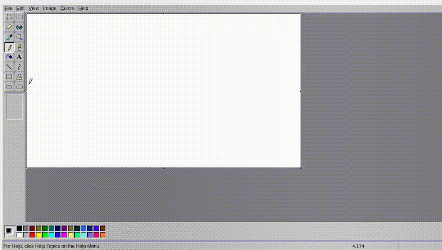

# Dia 3

## Mais Formas Geométricas

Podemos aproveitar nossa implementação feita ontem de `Polygon` para adicionarmos novas geométricas ao nosso leque de possibilidades. Além de ser uma oportunidade de exercitar o uso de **Herança**!

### Retângulo

Todos conhecemos essa forma geométrica, e sabemos que precisamos apenas de 2 pontos para instanciá-la. Sendo assim, como usar o `Polygon` que acabamos de implementar para criar um `Rectangle`?

```cpp
    class Rectangle : public Polygon  {
        public:
            Rectangle(Point2 top_left, Point2 bottom_right, Point2 scale = Point2(1, 1), double thick = 1) 
            : Polygon(...) {};

    };
};
```

Vamos **implementar**!

### Quadrado

Também sabemos que um quadrado é um caso especial de um **retângulo** só que com os lados iguais. Dito isso, basicamente temos dois cenários para criá-lo:
- Passamos um `center` e um `size`
- Passamos um `top_left` e um `size`

Mas perceba que como nesses dois casos, do ponto de vista da tipagem, as assinaturas dos construtores, em essência, são iguais, ou seja, ficaria algo assim:
```cpp
Square(Point2 top_left, unsigned int size, Point2 scale = Point2(1, 1), double thick = 1)
Square(Point2 center, unsigned int size, Point2 scale = Point2(1, 1), double thick = 1)
```

Para o compilador, os dois casos são o mesmo, por mais que semanticamente sejam situações diferentes. Para isso, vamos usar um conceito chamado **Static Factory Methods**. O que consiste em basicamente em ter **Métodos construtores**, dessa forma:

```cpp
    class Square : public Rectangle {
        public:
            static Square fromCorner(const Point2& top_left,
                                      unsigned int size,
                                      Point2 scale = Point2(1,1),
                                      double thick = 1);

            static Square fromCenter(const Point2& center,
                                     unsigned int size,
                                     Point2 scale = Point2(1,1),
                                     double thick = 1);

        private:
            Square(const Point2& p1,
                   const Point2& p2,
                   Point2 scale,
                   double thick)
                : Rectangle(p1, p2, scale, thick) {}
        };
};
```

Ah, e esse `static` antes do tipagem serve para podemos instanciar assim:

```cpp
Square s = Square::fromCenter({0,0}, 100);
```

Ao invés de ter que fazer assim:

```cpp
Square s;
s.fromCenter({0,0}, 100);
```

Certo, mas como ficaria o `.cpp`?

## Anti-Aliasing

**Anti-Aliasing** é um termo que talvez você já tenha ouvido falar, principalmente no contexto dos jogos. Geralmente na parte das configurações de gráficos a maioria dos jogos de hoje em dia tem uma opção de habilitar algum tipo de Anti-Aliasing, mas o quê ele faz exatamente?

Bom, se você jogava jogos com os gráficos no mínimo talvez as vantagens dele talvez tenham passado desapercebidas. Isso porque, sem a presença de uma qualidade de gráficos considerável, a presença do Anti-Aliasing mais atrapalha do que ajuda.

:::{figure} https://preview.redd.it/forget-hitboxes-which-anti-aliasing-setting-do-you-use-off-v0-9wb9suvoojpa1.png?auto=webp&s=82f4cf66371bf7042d8570d1716b0ccd970763c2
:align: center

https://www.reddit.com/r/RocketLeague/comments/11zvjxl/forget_hitboxes_which_antialiasing_setting_do_you/

:::

Você pode imaginar o **Anti-Aliasing** como um suavizador de linhas. Na prática, ele é responsável por esse efeito aqui:


:::{figure} https://www.showmetech.com.br/wp-content/uploads//2019/05/fxaa_amd-radeon.jpg
:align: center

https://www.showmetech.com.br/anti-aliasing-efeito-torna-melhor-jogatina/
:::

Certo, mas por que isso é importante no nosso contexto? Para isso, vamos recapitular o que sabemos sobre linhas. 

### Solução trivial

Repare nessa imagem de resolução 20x10 gerada abaixo:

```{image} assets/dia_3/linha.png
:alt: Linha em uma imagem 20x10
:width: 600px
:align: center
```

Percebe o quão evidente fica esse **aspecto serrilhado** da linha? Isso acontece pois a baixa resolução faz com que nossa a nossa linha de **intensidade binária**, até o momento, tente discretizar através de pixels um espaço contínuo muito grotesco. 

Certo, então basta aumentar a resolução, certo? Ficaria algo mais ou menos assim:

```{image} assets/dia_3/sem_thickness.png
:alt: Linha em uma imagem 400x200
:width: 600px
:align: center
```

Agora o aspecto serrilhado diminuiu mas a linha afinou muito, isso acontece pois nossa linha até o momento não implementando **thickness** na linha(vamos resolver isso depois), de forma que a grossura dela é fixa em uma unidade. E a partir disso conseguimos concluir que aumentar a resolução, em partes, resolve o problema do serrilhamento, mas **não em definitivo**. 

A título de comparação, a diferença entre uma linha com e sem **Anti-Aliasing** é essa:

```{image} assets/dia_3/comparacaoAA.png
:alt: Linha em uma imagem 400x200
:width: 600px
:align: center
```

Percebeu? Talvez você deve ter tido que apertar o olho para notar a diferença, mas essa diferença tende a piorar quanto mais horizontal ou vertical a linha fica. Por isso, agora vamos implementar um algoritmo de geração de linha com **Anti-Aliasing**.

### Casos particulares

Antes de botar a mão na massa, vamos tirar um momento para analisar em quais casos uma linha com **Anti-Aliasing** é igual a uma linha sem. 

De cara podemos pensar nos casos de linhas horizontais, verticais e 45 graus:

```{image} assets/dia_3/comparacao.png
:alt: Comparação entre linha vertical e horizonal
:width: 600px
:align: center
```

Note que em todos os casos os pixels são **"acertados em cheio"** pela linha do espaço contínuo, mas para qualquer outro caso teremos que:

```{image} assets/dia_3/aliasing.png
:alt: Comparação entre linhas com e sem Anti-Aliasing
:width: 600px
:align: center
```

Ilustrado isso, podemos responder: O que diferencia os estilos de linha? **Quando a linha contínua não "acerta em cheio no pixel"**. Repare que a linha com Anti-Aliasing faz com que a intensidade do pixel seja proporcional ao quão perto ele chega de "acertar em cheio", já a linha normal pinta os pixels com a mesma intensidade.

Tendo isso claro, podemos de fato partir para a implementação!

## Implementação para Linha

O algoritmo que vamos implementar será o de **XiaolinWu**, para isso você vai precisar adicionar o `case DrawMethod::XialinWu:` na função `DrawObject`.

1. Escolher o eixo que vamos percorrer.
2. Calcular os diferenciais.
```{image} assets/dia_3/diferenciais.png
:alt: Visualização dos diferenciais
:width: 600px
:align: center
```
3. Calcular o gradiente.
```{image} assets/dia_3/gradiente.png
:alt: Diferenças de pixels
:width: 600px
:align: center
```
4. Calcular distâncias e as cores.
```{image} assets/dia_3/distance.png
:alt: Diferenças de pixels
:width: 600px
:align: center
```
5. Iterar do `p1` ao `p2` fazendo isso.

% An admonition containing a note
:::{note}
Talvez você entenda melhor [nessa](https://www.youtube.com/watch?v=f3Rs20k-hcI) explicação mais visual.
:::

## Adicionando Grossura

Certo, mas ainda não temos o **thickness** que falamos logo no começo da seção de **Anti-Aliasing**. Sendo assim, vamos implementar ele de um jeito bem trivial, usando recursos que já temos. Dado que já temos uma forma de implementar uma linha de grossura `1`, como podemos usar isso para implementar uma linha de grossura `n`?

```{image} assets/dia_3/thickness.png
:alt: Exemplo da ideia de thickness
:width: 600px
:align: center
```

Certo, para isso vamos precisar mexer de novo no nosso arquivo `line.cpp` e `line.hpp`.

% An admonition containing a note
:::{note}
Como recurso para o nosso **PEinT** é legal, mas por que do ponto de vista da complexidade essa ideia é meio *meh*?
:::


## Implementação para Círculos

Perceba que tanto `Line` quanto `Circle` implementam um mesmo método de desenhar com uma técnica de **Anti-Aliasing**. Nesse caso, teria sentido de um ponto de vista semântico que ambas implementassem uma **Interface** `Anti-Alias`, mas infelizmente(ou não, 😉) a linguagem C++ não suporta **Herança Múltipla**.

Tal qual em `Line`, vamos ter que mexer na função `DrawObject` aqui, adicionando um `case DrawMethod::XialinWu:`.

Dado o circulo que você quer plotar, imagine o raio `r` dele.
```{image} assets/dia_3/circulo1.png
:alt: Plot do ponto (r,r)
:width: 600px
:align: center
```
Podemos espelhar esse ponto em relação ao **eixo X**.
```{image} assets/dia_3/circulo2.png
:alt: Espelhamento desse ponto
:width: 600px
:align: center
```
Bem como também podemos espelhar em relação ao **eixo Y**.
```{image} assets/dia_3/circulo3.png
:alt: Espelhamento dos pontos acima
:width: 600px
:align: center
```
Esse esse pontos formam um quadrado que pode ser **circunscrito** através daquela famosa equação $x² + y² = r²$.
```{image} assets/dia_3/circulo4.png
:alt: Diferenças de pixels
:width: 600px
:align: center
```

5. Dito isso, feito o arco entre um eixo e o ponto `(r,r)`, basta usar o espelhamento que deduzimos para fazer o resto do círculo.
```{image} assets/dia_3/circulo5.png
:alt: Diferenças de pixels
:width: 600px
:align: center
```

Mas afinal, como fazer esse arco? Vamos iterar por **X**. Sabemos que vamos começar em 0 e vamos acabar em...

Baseado nesse **x**, temos o **y** correspondente. E esse valor sempre **"vai passar por 2 pixels"**, ou seja, quando `y = 2.73` sabemos que ele passa pelos pixels `2` e `3`. Daí aplicamos a mesma ideia que vimos anteriormente: Quanto mais perto do centro do pixel passamos, mais intenso é a cor daquele pixel.

% An admonition containing a note
:::{note}
Você pode se aprofundar na implementação consultando o artigo original em que o algoritmo é introduzido: https://dl.acm.org/doi/10.1145/127719.122734
:::

## Preenchimento

Até o momento temos algo muito parecido com o Paint©. Mas ainda está faltando algo quase essencial para desenharmos, a função de **Balde de Tinta**.

<div  class="figure"  style="flex: 1; text-align: center;">



<p  style="margin: 0.5rem auto 0; text-align: center;"><em><br  />Balde de tinta no paint funcionando</em></p>

</div>

### Como funciona o algoritmo da ferramenta do balde?

A ideia do algoritmo de preenchimento é pintar uma região com apenas uma cor escolhida. Assim, é preciso entender como é definida uma região pelo algoritmo que nós vamos utilizar.

Uma região é o conjunto de todos os pixels de mesma cor que são vizinhos olhando para uma das 4 direções bidimensionais (cima, baixo, esquerda, direita). Com essa definição, para pintar uma região, é preciso:
1. Escolher a cor principal a ser usada.
2. Escolher um pixel de início.
3. Salvar a cor desse pixel como a cor da região.
4. Pintar o pixel escolhido com a com a cor principal.
5. Visitar todos os vizinhos do pixel escolhidos que têm a mesma cor da região.
6. Repetir a etapa 4 e 5 até que não se consiga mais visitar nenhum pixel da cor original da região

### Estruturas necessárias para o algoritmo

Para utilizar realizar o que foi descrito, é preciso de uma estrutura que consiga armazenar quais pixels serão visitados. Para isso, será utilizada uma pilha.

### A ferramenta de preenchimento

Essa é a classe da ferramenta de preenchimento. Ela tem duas funções principais, uma auxiliar para decidir se duas cores são iguais dada uma certa tolerância, e outra para propriamente fazer o trabalho principal.
```cpp
class Fill {
    public:
        virtual ~Fill() = default;
        
        virtual void fill(Canvas& canvas, const Pixel& seed, const RGBColor& fillColor);

    protected:
        virtual bool colorsMatch(const RGBColor& color1, const RGBColor& color2, double tolerance = 0.0) const;

    };
```

Esse é o arquivo .cpp

```cpp
void FloodFill::fill(Canvas& canvas, const Pixel& seed, const RGBColor& fillColor){
        /*Encontre a cor original do pixel escolhido e salve ela em uma variável*/
        
        /*Se a cor do fill for igual a cor original, não tem mais nada a ser feito, então pare a execução*/
        
        /*Crie a estrutura que armazena os pixels a serem visitados*/

        /*Adicione o pixel inicial à estrutura que armazena os pixels*/
        
        /*Enquanto a ainda houver pixels a serem visitados execute o seguinte loop*/
            /*Retire o pixel do topo da pilha e pinte ele com a fillColor*/
            
            /*Adicione todos os seus vizinhos na pilha, desde que eles tenham a mesma cor que a cor original*/
        
        /*Quando o loop acabar, todos os pixels da região serão da cor escolhida*/
        
    }

    bool Fill::colorsMatch(const RGBColor& color1, const RGBColor& color2, double tolerance) const {
        /*TODO*/
    }
```

# Desafios!
