# Dia 4

No dia anterior, terminamos a parte de "desenhos" do rasterizador, mas ainda temos alguns problemas não resolvidos. Digamos que tenhamos um desenho simples de um retângulo, vou tentar fazer ele perto do centro:

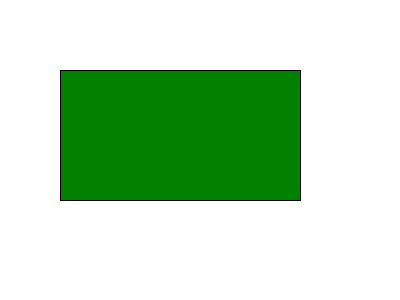

\
OH NAO, O RETÂNGULO NÃO ESTÁ CENTRALIZADO! D:

Normalmente, o comum de fazer nesse cenário é tentar encontrar novos valores para os vértices (normalmente tentativa e erro) que se encaixam no nosso objetivo (nesse caso, centralizar). 

Para essa imagem, o canva tem tamanho $400$ x $300$ e o retângulo tem seus vértices em $(60, 70)$, $(300, 70)$, $(300, 200)$ e $(60, 200)$. Um jeito viável de resolver esse problema é pegar o centro do retângulo e ver a distância dele para o centro do canvas. 

O centro deste retângulo é o ponto $P = ((300 + 60)/2, (200 + 70)/2) = (180, 135)$.
O centro do canvas é o ponto $C = (400/2, 300/2) = (200, 150)$. 
Nesse sentido, teremos um deslocamento de (20, 15) entre os centros.

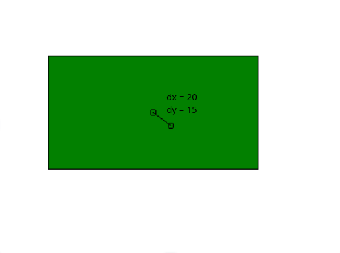

\
Por fim, se você deslocar cada um dos vértices por $(20, 15)$, você irá movimentar o retângulo para o centro da imagem.

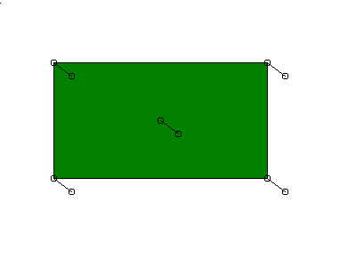

\
E assim:

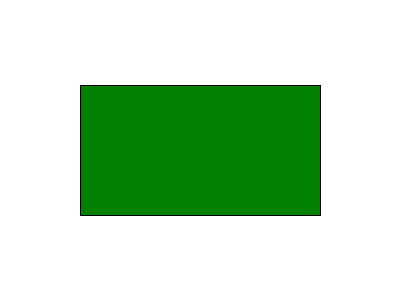

\
Quando se tratam de projetos pequenos como este, o cálculo é simples. Porém, em projetos complexos com uma grande diversidade de formas, calcular isso vértice a vértice será extremamente trabalhoso. Temos diversas outras operações visuais que sofrem do mesmo problema de complexidade, como rotações ou alterações de escala. Por isso, precisamos generalizar esse problema para podermos movimentar, rotacionar e alterar o tamanho de todos os objetos de forma limpa e unificada.

## Transformações Geométricas

Uma Transformação Geométrica é, em resumo, uma função que recebe um ponto (ou um conjunto de pontos) e devolve um novo ponto (ou conjunto de pontos) com alguma alteração espacial definida previamente.

Algumas transformações que vamos implementar hoje pertencem a uma categoria chamada **Transformações Lineares**, que têm uma propriedade fundamental: retas continuam retas, e proporções entre pontos colineares são preservadas. 

Rotação e escala são os três exemplos clássicos de transformação afim.

### Por que não usar apenas funções soltas?

O maior problema de utilizar funções isoladas (ex: `translate(p, dx, dy)`) está na dificuldade de composição. Se quisermos rotacionar, escalar e movimentar o mesmo objeto, teríamos que chamar várias funções em sequência para cada vértice. Se quisermos aplicar isso a uma cena inteira, o custo computacional e a bagunça no código crescem exponencialmente

Em relação a isso, temos uma solução bem mais bonita vinda da **Álgebra Linear**, que são as **Matrizes de Transformação**.

Basicamente, faremos com que uma "função de transformação geométrica" vire apenas uma multiplicação entre uma matriz e um ponto. Isso não só reduz a complexidade do código, como nos permite combinar múltiplas transformações em uma única matriz antes mesmo de encostar nos vértices do desenho.

### O problema das Matrizes

Voltando para o problema da centralização, a transformação que aplicamos se chama **Translação**. Nós fizemos cada ponto do retângulo transladar por um delta espacial $(dx, dy)$. De forma matemática seria:

$x_F = x_0 + (P_x - C_x)$ 

$y_F = y_0 + (P_y - C_y)$

Ou, de forma mais genérica (ao invés de um ponto para outro)

$x_F = x_0 + dx$ 

$y_F = y_0 + dy$

Parece simples, mas surge um obstáculo de álgebra linear: translações envolvem apenas somas, não multiplicações. Como representamos uma soma usando multiplicação de matrizes 2x2? 

A resposta é: não podemos :D

#### Coordenadas Homogêneas

A solução da computação gráfica é usar **coordenadas homogêneas**. Em vez de representar um ponto 2D como $(x, y)$, adicionamos uma terceira coordenada virtual $z$, representando o ponto como $(x, y, 1)$. Com essa dimensão extra, podemos usar uma matriz 3x3 para aplicar transformações num espaço 2D, transformando a soma da translação em uma multiplicação perfeita:

```
| 1 0 dx |   |x|   |x + dx|
| 0 1 dy | * |y| = |y + dy|
| 0 0 1  |   |1|   |  1   |
```

A partir de agora, qualquer transformação afim pode ser representada como:

```
P' = M * P
```

onde `P` é o ponto em coordenadas homogêneas e `M` é a matriz 3x3 da transformação.

## Criando a classe Transform

Com essa ideia em mente, podemos pensar em como estruturar nossa classe. Ela precisa guardar internamente uma matriz 3x3 (o "estado atual" da transformação) e oferecer métodos para atualizar essa matriz quando quisermos rotacionar, transladar ou escalar.

```cpp
class Transform {
    private:
        Mat3 mat;
    public:
        Transform();
        Transform(const Transform&) = default;
        Transform(const Mat3&);

        void rotate(double degrees, Point2 axis);               /*TODO*/
        void translate(Point2 delta);                           /*TODO*/
        void scale(double deltax, double deltay, Point2 axis);  /*TODO*/

        Point2 operator*(const Point2&) const;                  /*TODO*/
        Transform operator*(const Transform&) const;            /*TODO*/
};
```

### Generalizando a translação

Como mostramos no primeiro exemplo, a translação será realizada a partir de um ponto P, e deslocaremos esse ponto P por um **delta**. Usando coordenadas homogêneas, essa operação pode ser escrita como a seguinte matriz 3x3:

```
| 1  0  dx |   | x |
| 0  1  dy | * | y |
| 0  0  1  |   | 1 |
```

Multiplique essa matriz pelo ponto `(x, y, 1)` no papel e verifique que o resultado é exatamente `(x + dx, y + dy, 1)`, ou seja, o mesmo resultado que a função da aula passada já calculava. A partir disso, você terá a matriz que deve ser usada dentro do método `translate` da classe `Transform`.

### Rotação

A fórmula de rotação de um ponto em torno da **origem** $(0, 0)$ por um ângulo $θ$ (em radianos) utiliza um pouco de trigonometria:

```
x' = x*cos(θ) - y*sen(θ)
y' = x*sen(θ) + y*cos(θ)
```

Assim como a translação, essa fórmula também pode ser escrita como uma matriz 3x3 usando coordenadas homogêneas.

```
| cos(θ) -sen(θ)  0 |
| sen(θ)  cos(θ)  0 |
|   0       0     1 |
```

Obs: Lembrem-se que as funções std::cos e std::sin do c++ utilizam o ângulo em **RADIANOS** ao invés de **GRAUS**.

O exemplo abaixo irá rotacionar em $45⁰$  em torno da origem:
Note que, a matriz resultante com $45⁰$  iria ser:
```
| cos(45⁰) -sen(45⁰)  0 |   | 0.707 -0.707  0 |
| sen(45⁰)  cos(45⁰)  0 | = | 0.707  0.707  0 |
| 0         0         1 |   | 0      0      1 |
```
Caso queira replicar essa matriz em c++, lembre-se de que você deverá alterar o valor de $45⁰$ para $π/4$

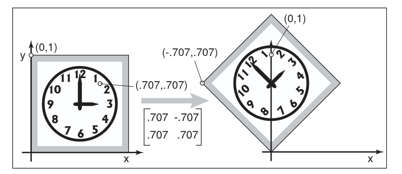

Só que, no nosso projeto, o método `rotate` recebe um parâmetro extra chamado `axis`, do tipo `Point2`. Isso acontece porque, na prática, quase nunca queremos rotacionar um objeto em torno da origem `(0, 0)` — normalmente queremos rotacioná-lo em torno de algum ponto de referência (seu centro, por exemplo). Esse ponto de referência é chamado de **pivô**.


Como a fórmula de rotação só produz o resultado esperado quando o pivô é a origem, usamos a seguinte técnica:

1. Transladar o objeto de forma que o pivô coincida com a origem;
2. Aplicar a rotação normalmente em torno da origem;
3. Transladar o objeto de volta para a posição original do pivô.

O resultado será a matriz composta:

$M = T_2 * R * T_1$

### Escala

A escala funciona de forma parecida com a rotação. Escalar um ponto em torno da origem por fatores `sx` e `sy` (um para cada eixo) é simples:

```
x' = x * sx
y' = y * sy
```

Assim como na rotação, isso também pode ser escrito como uma matriz 3x3. 

```
|  sx  0   0 |
|  0   sy  0 |
|  0   0   1 |
```

Abaixo temos dois exemplos de mudança de escala utilizando algumas matrizes específicas:


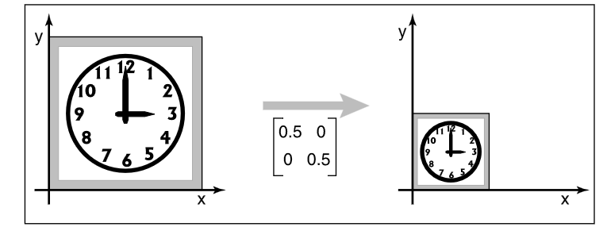


O primeiro exemplo utiliza uma mudança de escala simétrica, então acaba que não deforma tanto a imagem original, porém, na segunda temos:


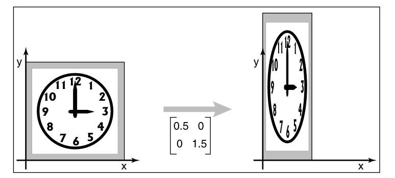


Exatamente por terem pesos diferentes, a imagem acaba sendo deformada.


E, assim como na rotação, o método `scale` também recebe um `axis`, pois normalmente queremos escalar um objeto em torno de um ponto de referência (por exemplo, seu centro), e não em torno da origem.

A imagem abaixo mostra essa aplicação funcionando:


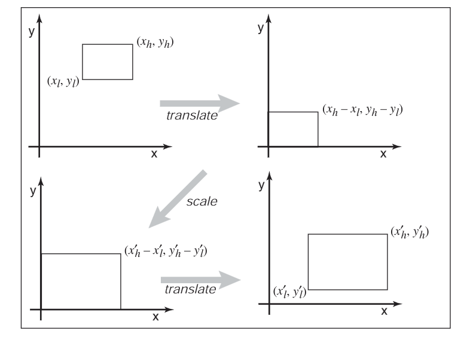

A mesma técnica usada para resolver o problema do pivô na rotação deve ser reaproveitada aqui, trocando apenas a matriz do meio (de rotação para escala).

$M = T_2 * S * T_1$

## Compondo Transformações

Um dos pontos mais importantes de representar transformações como matrizes é que, ao aplicarmos uma nova transformação sobre um objeto que já tinha sido transformado antes, **não precisamos refazer o trabalho do zero**. Basta multiplicar a nova matriz de transformação pela matriz que já estava guardada na nossa `Transform`.
 
Isso é o que permite, por exemplo, que você chame `rotate` e depois `translate` no mesmo objeto `Transform`, e o resultado final já leve em conta as duas operações em sequência, sem precisar guardar uma lista de transformações separadas — resolvendo exatamente as limitações que apontamos na introdução sobre a função da aula passada.

Para isso, faz sentido adicionar o operador `*`, mas dessa vez recebendo outra `Transform` como parâmetro:

```cpp
Transform operator*(const Transform&) const;
```


## Aplicando a Transform sobre um ponto

Depois de configurar a matriz interna da nossa `Transform` (seja ela uma translação, rotação, escala, ou uma composição dessas), precisamos de uma forma de efetivamente aplicá-la sobre um ponto do nosso desenho. É para isso que existe o operador `operator*(const Point2&)`.

Lembre-se de que nossos pontos são armazenados como `Point2` (duas coordenadas), mas a matriz é 3x3 e trabalha com coordenadas homogêneas. Ou seja, antes de multiplicar, é preciso converter o `Point2` para um `Point3` com a terceira coordenada valendo `1`, multiplicar pela matriz, e depois converter o resultado de volta para `Point2`, descartando a terceira coordenada.


  
## Aplicando a Transform sobre um Object
 
Ao contrário do que parece, apenas aplicar diretamente em cada ponto nem sempre faz o que queremos. Para generalizar para todos os Objects, criaremos dois novos métodos em cada uma das nossas classes:

```cpp
// object.hpp

/**
* @brief Função que aplica uma matriz de rotação no objeto
* @param transformation Transformação que será aplicada
*/
virtual void transform(const Transform& transformation);

/**
* @brief Função que retorna o eixo de transformação do objeto
*/
virtual Point2 getAxis() const;

```

No geral, o "Eixo de transformação" seria o "ponto centroide" de nossos objetos, como o centro de um quadrado, por exemplo. 
Para as classes que irão extender Object, basta você implementar essa ideia.

Agora, o método `transform` terá que aplicar a transformação recebida por parâmetro em cada um dos pontos do Object. Por exemplo, se eu quiser rotacionar uma reta, basta eu aplicar a operação de multiplicação entre a transformação e cada ponto.

Segue aqui um exemplo para a classe `Line`:

```cpp

Point2 Line::getAxis() const
{
    Point2 average = (start + end) / 2; // Pega o ponto central da reta
    return average;
}

void Line::transform(const Transform& transformation) 
{
    this->start = transformation * start; // Aplica a transformação
    this->end   = transformation * end;   // nos dois pontos
}

```
## Extras

Além dessas transformações, temos diversas possibilidades de transformações lineares que podem ser aplicadas. Nesse sentido, crie as seguintes funções da classe Transform:

##

- Reflexão : Inverte a posição do ponto em torno de um **axis**
    - Você pode criar a `reflectX()` e `reflectY()` para refletir entre os eixos X e Y caso prefira.
    - A matriz reflexão entre o eixo Y é bem similar a de rotação, tente pensar em um jeito de aplicar de forma similar.

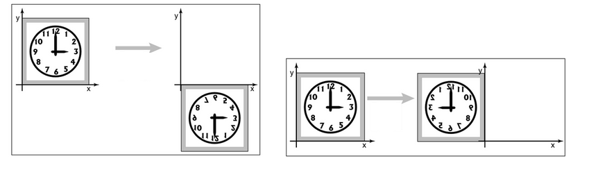

##

- Cisalhamento : Inclina o objeto ao longo de um eixo
    - Você pode criar a `shearX(double s)` e `shearY(double s)` para refletir entre os eixos X e Y, caso prefira.
    - A matriz de cisalhamento move um dos eixos por um delta (o 's' da função), enquanto o outro eixo se mantêm fixo, então ela acaba sendo muito similar a de Translação.
    - Existem formas de implementar o cisalhamento com a lógica da matriz de rotação, utilizando uma tangente como o escalar (s) dela, pode ser uma implementação viável caso tenha interesse.

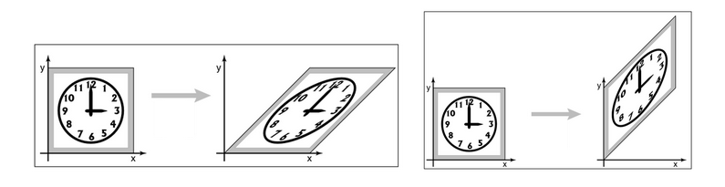

\
Caso queira testar, uma rotação também pode ser constituída de 3 Cisalhamentos em seguida, como no exemplo abaixo:

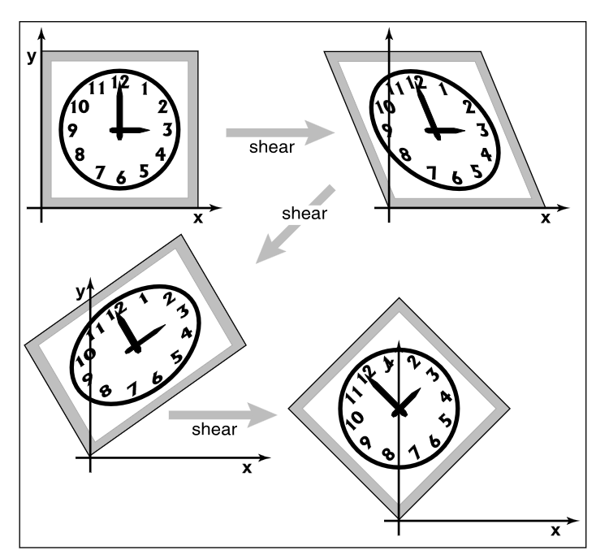

##

## Referências

- SHIRLEY, Peter et al. **Fundamentals of Computer Graphics**, vol 3.
